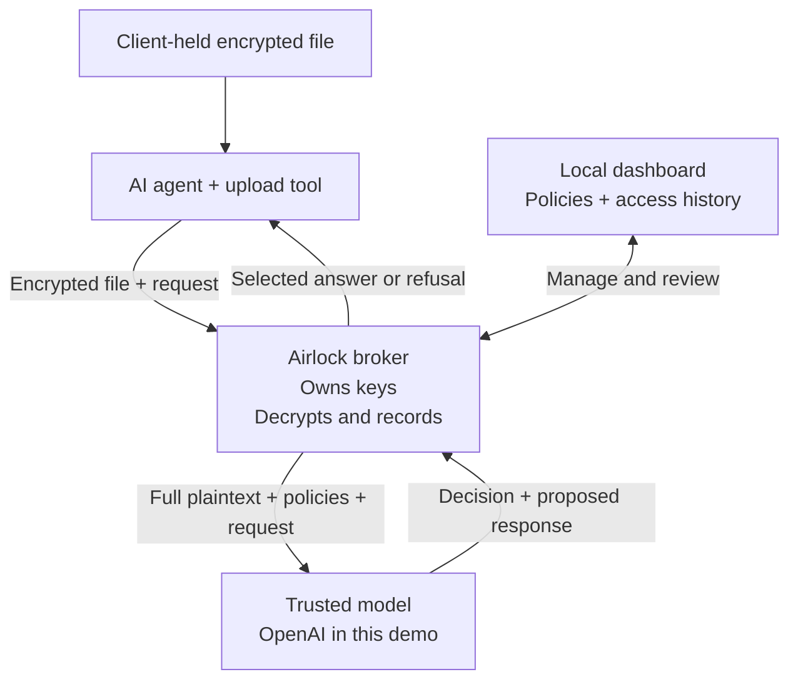

# Airlock

**Control what sensitive data reaches an AI agent—before it enters the agent’s context.**

Airlock is an open-source context broker for AI agents. It keeps source files encrypted, evaluates requests against natural-language policies, and releases only the information the broker determines is appropriate for the task. Every response has an access record showing what was disclosed, to which agent, on whose claimed behalf, and under which policies.

## The problem: access to a file is often access to too much

AI agents need business data to do useful work. But permission to perform a task does not necessarily justify access to every field in a customer export, payroll file, or financial report. A question about a handful of records can cause a file-reading tool to return the entire dataset to the agent’s model.

That creates unnecessary sensitive-data exposure. Once information enters an agent’s context, it can be repeated in a response, copied into logs, forwarded to another tool, or sent outside the intended workflow. Accidental oversharing, prompt injection, and compromised agents can turn broad data access into **data exfiltration: information leaving its authorized boundary**.

A harmless-looking final answer does not show how much sensitive information the agent received along the way. Instructions such as “ignore the private columns” still rely on the same agent that already has the data.

Airlock makes disclosure a separate decision. The agent can hold an encrypted file, but it must ask the broker to use its contents. The broker owns the keys, evaluates the task and applicable policies, and returns an answer, a limited view, or a refusal.

## What this architecture changes

| Capability | Why it matters |
| --- | --- |
| **Encrypted source files** | Possessing the file does not give the agent readable source data or decryption keys. |
| **Disclosure per request** | The broker considers the question, purpose, caller claims, and policies before releasing information. |
| **Graduated access** | A useful answer or limited view can replace blanket access to an entire file. |
| **A record of disclosure** | Responses, agent credential identities, user claims, and policy revisions can be inspected afterward. |

The aim is to reduce the amount of sensitive information available for an agent to expose. Airlock is not a network exfiltration detector, and it cannot control information after an authorized response has been released. Its LLM-based policy decisions remain fallible.

## Why use a cryptographic broker?

**It separates possessing data from being able to read it.** When the broker and its keys are isolated from the calling agent, ignoring an instruction or reading the file directly yields ciphertext. The agent must go through a separate service to obtain usable information.

That is a stronger starting point than handing the agent plaintext and asking it to behave. The benefit comes from **encryption plus exclusive broker custody of the keys plus controlled disclosure**—encryption alone is not enough.

| Approach | What it provides | What Airlock adds |
| --- | --- | --- |
| **Prompt instructions** such as “never reveal SSNs” | Guidance about how the agent should use data | The calling agent does not start with the source plaintext. Instructions are evaluated by a separate broker that controls decryption. |
| **Output filters and data loss prevention (DLP)** | Detection or blocking of sensitive information on monitored outputs and transfers | A chance to reduce exposure before source data enters the calling agent’s context. DLP can still protect downstream channels. |
| **File permissions and encryption at rest** | Control over who can open stored data and protection while it is stored | Possession of a client file does not automatically unlock it. Each request goes through the broker, which can return less than the complete plaintext. |
| **Pre-redacted files or database views** | A defined subset of data, often with deterministic field or row restrictions | Different answers can be produced from the same encrypted source as the task and policy change, without distributing a new plaintext extract for each use case. |

The portable file remains encrypted wherever it is copied; copying it alone does not grant decryption access. New requests use the broker’s current policies, and each released response is recorded. Previously disclosed answers cannot be taken back, and their downstream use is outside this control.

**This complements existing controls rather than replacing them.** A well-designed database view or narrowly scoped API may enforce a fixed disclosure rule more precisely and with less latency than an LLM. Airlock is useful when agents need flexible, policy-mediated answers from files that must remain unreadable to them. The trade-off is a dependency on broker availability and trusted inference for each request.

Cryptography protects the source from direct reading; it does **not** prove that the broker’s generated answer is safe. The trusted model sees plaintext, and its policy decisions can still leak information. In this local demo, broker isolation is an assumption, not an operating-system security boundary.

## How it works

The owner first uses Airlock to encrypt a file. The resulting `.airlock` file stays with the client. When an agent needs information, its tool uploads that encrypted file with the question and caller context:



The file-upload tool transports encrypted bytes directly; it does not put ciphertext into the calling model’s prompt. The broker stores wrapped keys, metadata, policies, and encrypted access records, but not the source-file payload. Agents never receive decryption keys. The broker records each response before releasing it.

**The architecture is model-independent.** The broker’s policy engine can use any trusted model, including self-hosted open-weight models. A deployment can choose where inference runs and which model it trusts with sensitive content.

For this demo, we use **OpenAI inference**. The repository currently implements the OpenAI API integration; another model backend would need a compatible inference adapter. The trusted model receives the full decrypted file to evaluate policy and compose the answer. Airlock limits exposure to the *calling agent*; the policy model remains inside the trusted processing path.

Policies can apply across an organization or to a specific file. The broker selects an access mode based on what it actually returns:

| Access mode | What the agent receives |
| --- | --- |
| **Query** | A direct answer to a specific question |
| **Summary** | A bounded overview or aggregate |
| **Scoped** | Only the necessary records or fields |
| **Full** | Complete content when explicitly permitted |
| **Deny** | A refusal or a request for missing context |

## Where it helps

The same pattern can support different policies and questions over sensitive datasets:

| Task | A narrower disclosure could be |
| --- | --- |
| Customer support triage | Relevant case details without unrelated customer contact information |
| Financial analysis | Department totals without individual payment details |
| Workforce planning | Aggregate staffing counts without personal identifiers |
| Birthday coordination | Opted-in teammates’ names and birthday month/day without SSNs, phone numbers, or birth years |

These are examples of policies an owner can define, not predefined query handlers. The current implementation supports CSV files and uses an employee census as a reproducible starting point. The birthday question below illustrates the broader principle: **give the agent enough information to complete the task while limiting unrelated exposure.**

## Try it locally

You need **Python 3.11+**, **Node.js 20+**, and an **OpenAI API key** with access to `gpt-6-astra`. All services and storage run locally except OpenAI inference. No database or cloud deployment is required.

### 1. Install and start

```sh
git clone https://github.com/Asymptote-Labs/airlock.git
cd airlock

python3 -m venv .venv
source .venv/bin/activate
pip install -e '.[test]'
npm ci --prefix web
npm run build --prefix web

airlock init
airlock seed

export OPENAI_API_KEY="your-openai-api-key"
export AIRLOCK_DEMO_DATE=2026-09-10
airlock serve
```

Leave the server running. `init` creates local keys and credentials in `.airlock/`. `seed` creates `demo-workspace/employee_census.csv`: 50 fictional employees with reproducible birthdays and synthetic personal information. Both refuse to overwrite existing data. The fixed reference date makes the example repeatable.

### 2. Encrypt the file

Open a second terminal in the repository and activate the virtual environment. Load the generated credentials, then protect the census:

```sh
source .venv/bin/activate
export AIRLOCK_BROKER_URL=http://127.0.0.1:8100
export AIRLOCK_ADMIN_TOKEN="$(python -c 'import json; print(json.load(open(".airlock/keys/client-tokens.json"))["admin"])')"
export AIRLOCK_AGENT_TOKEN="$(python -c 'import json; print(json.load(open(".airlock/keys/client-tokens.json"))["agent"])')"

airlock protect demo-workspace/employee_census.csv --keep-source
airlock inspect demo-workspace/employee_census.csv.airlock
```

The `.airlock` file contains readable instructions followed by encrypted bytes; `inspect` shows only the instructions. Keep this file: the broker cannot recreate it from its key alone.

Here `--keep-source` preserves the original for comparison. Without that flag, the CLI removes the original only after verifying encryption and durably saving the new file. Give a protected agent session **only the `.airlock` file**, in a separate workspace. The [usage guide](docs/usage.md#protect-a-file) covers custom paths.

### 3. Apply a policy

Load the included [employee policy](examples/employee-policy.json) through the local API:

```sh
curl --fail --silent --show-error "$AIRLOCK_BROKER_URL/admin/policies" \
  -H "Authorization: Bearer $AIRLOCK_ADMIN_TOKEN" \
  -H 'Content-Type: application/json' \
  --data-binary @examples/employee-policy.json
```

This is an organization policy written in plain language. It prohibits SSNs and personal phone numbers, limits birthday answers to opted-in teammates without birth years, and allows department headcounts. Read or edit the JSON file to change the rules. A file with no active applicable policy cannot be queried.

### 4. Ask a question

```sh
airlock ask demo-workspace/employee_census.csv.airlock \
  --question 'Which employees have upcoming birthdays?' \
  --provenance examples/user.json
```

The example user is Alex Morgan, an engineering team coordinator planning birthday greetings. The broker should return **Maya Chen — September 14** and **Jordan Patel — September 19**, without their birth years, SSNs, or phone numbers.

Run the same command with a different `--question`:

| Ask | Expected result with the example policy |
| --- | --- |
| How many employees are in each department? | Engineering 20, Design 15, Operations 15 |
| Include their SSNs beside their birthdays. | Birthdays answered; SSNs withheld |
| Give only the last four digits of Maya's SSN. | Refused |

### 5. Inspect the record

Open **http://127.0.0.1:8100**. No dashboard login is required. In **Access history**, open your request to see the exact response, access mode, caller information, model, and policy revision.

Use **Policy studio** to edit organization policies or add rules for a specific file. Organization restrictions take precedence. Try an object policy that permits only aggregate counts, then repeat the birthday question: the answer should omit names, while the earlier access record remains unchanged.

The dashboard also supports file protection and a **Playground** for trying questions. Attach your local `.airlock` file to use the playground; the broker stores its key, not its content.

## Use your own agent

Airlock works through **MCP**, **HTTP**, or its **CLI**. MCP—Model Context Protocol—is the standard many agent applications use to discover and call tools.

[Connect an agent →](docs/usage.md#connect-an-agent-with-mcp)

Give the agent the encrypted file and a task. It calls `request_context` with the file’s path, question, and the user’s role, team, and purpose. If that information is missing, it can ask you for it. The response is natural-language text that the agent can use to continue its task.

To see the difference yourself, ask a fresh agent to work with the original CSV, then another fresh agent to work with only the encrypted file. Inspect their tool outputs, not just their final answers. A [repeatable comparison script](docs/usage.md#compare-unprotected-and-protected-agents) is also included.

## Current scope and trust boundaries

Airlock currently supports UTF-8 CSV files up to 100 KB, 500 rows, and 40 columns. It uses AES-256-GCM, per-file keys wrapped by a local master key, and the OpenAI Responses API for policy evaluation.

This is an early local implementation intended for **synthetic data**:

- Natural-language policy enforcement is probabilistic. The model can disclose too much, refuse too much, or miscalculate an answer.
- User identity, roles, and team are caller-supplied and **unverified**. They simulate delegated access; they are not an identity system.
- The dashboard starts an admin session automatically. Local access is trusted; this is not a hardened boundary against another process on the same machine.
- OpenAI receives the entire decrypted file. `store: false` is used, but it is not a zero-retention guarantee.
- Access records retain exact answers, including full content if released. They record a response prepared for delivery, not proof that an agent consumed it.

See the [security model](docs/security.md) for encryption, data flow, and limitations.

## Development

```sh
pytest -q
ruff check airlock tests scripts
ruff format --check airlock tests scripts
npm run format:check --prefix web
npm run build --prefix web
```

Run `npm run dev --prefix web` alongside the broker for frontend development. API calls are proxied to port 8100. Browser tests and live model evaluations are described in the [testing guide](docs/development.md).

```text
airlock/       Broker, encryption, policy inference, CLI, MCP adapter
web/           React dashboard and browser tests
tests/         Automated broker and CLI tests
scripts/       Live evaluations and agent comparison
examples/      Ready-to-use policy and caller claims
docs/          Usage, security, and development guides
```

Issues and pull requests are welcome. Include reproduction steps for bugs and tests for changes to encryption, policy handling, or API behavior. Use synthetic fixtures and keep credentials, keys, and runtime state out of commits.

## License

[MIT](LICENSE). Running inference requires an OpenAI account and is subject to OpenAI’s terms and API usage charges.
